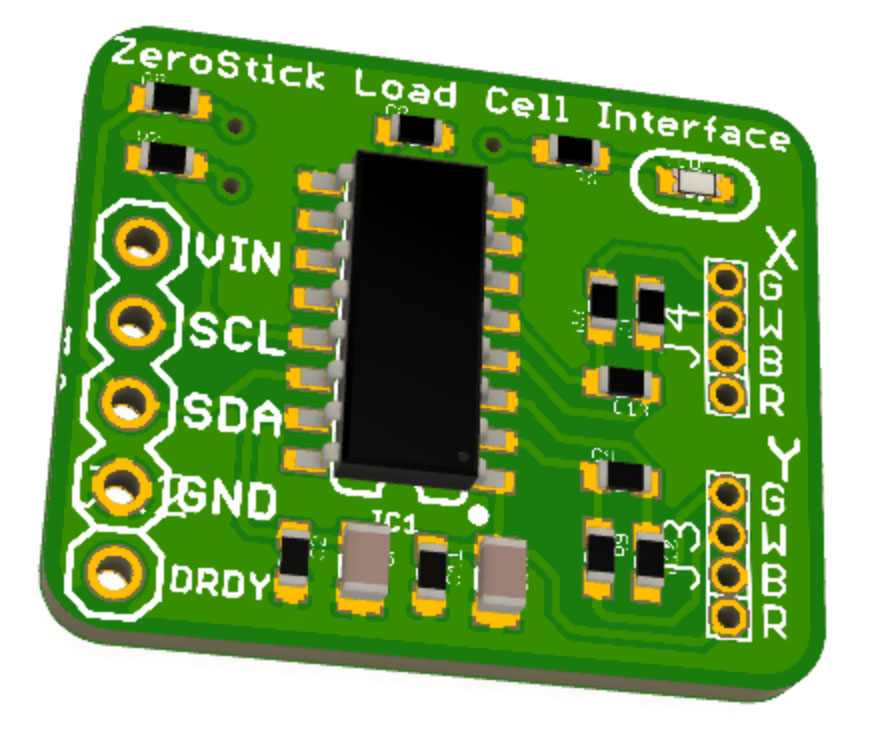

"ZeroStick" Zero-Deflection Assistive Technology Joystick
==========================================================

ZeroStick is a joystick that uses strain gauges to measure force
applied to it, without the joystick needing to move. The joystick
"position" is determined from the force being applied to it, instead of
any physical deflection of the stick.

The term "position" is used here to signify the virtual position of the
joystick, even though it doesn't physically move. As more force is
applied, the virtual position of the joystick is considered to change.

This allows it to be used by people with a limited range of motion,
such as from Duchenne muscular dystrophy.

The sensitivity of the joystick can be adjusted in software by changing
the scaling of the values detected by the strain gauges.

The position value is measured as % deflection from the zero (central)
position, ie: from -100% to +100%. This is equivalent to full effort by
the user in each direction.

The force applied to the load cells is measured using a NAU7802 ADC
with an I2C interface. The input channels are split so that a single
ADC can read both the X and the Y axis load cells sequentially.

You can view more details at:

  http://www.superhouse.tv/zerostick

Hardware
--------
The "Hardware" directory contains the PCB design as an EAGLE project.
EAGLE PCB design software is available from Autodesk free for
non-commercial use.

Firmware
--------
The "Firmware" directory contains example firmware as an Arduino
project.

The example firmware has three output methods:

1. Mouse output. When enabled and plugged into a computer, the ZeroStick
will emulate a USB mouse. Buttons on the ZeroStick can also send left
and right click events.

2. Joystick output. When enabled and plugged into a computer, the
ZeroStick will emulate a USB game controller with a joystick.

3. I2C digital potentiometer output. External I2C digital potentiometers
can be connected, which can then emulate a simple analog joystick
when connected to another device such as a wheelchair. This allows the
ZeroStick to control wheelchairs that expect to have a normal joystick
attached.

Credits
-------
  * Jonathan Oxer <jon@oxer.com.au>
  * Chris Fryer <chris.fryer78@gmail.com>

License
-------
Copyright 2019-2020 SuperHouse Automation Pty Ltd  www.superhouse.tv  

The hardware portion of this project is licensed under the TAPR Open
Hardware License (www.tapr.org/OHL). The "license" folder within this
repository contains a copy of this license in plain text format.

The software portion of this project is licensed under the Simplified
BSD License. The "licence" folder within this project contains a
copy of this license in plain text format.
